# SunsecScaner


web扫描器

* 常见的功能性扫描
  * 后台路径扫描
  * 端口扫描
  * 应用指纹扫描
  * 局域网ip扫描
* 常见web漏洞扫描
  * 爬虫爬取url
  * sql注入
    * union注入
    * 基于错误的注入
    * 基于time的注入
    * 基于Boolen的注入
  * xss
    * dom xss 扫描
    * 反射型
    * 储存型
  * LFi 扫描
    * 本地文件包含扫描
    * 路径穿越扫描
  * ssrf 扫描

## 常见功能模块
--------

### 路径扫描
-----


使用

```
python main.py -u htt://xxxx -p 1 [-d 指定字典] [-n指定协程的数量]
```

字典和协程数量可以自己指定，也可以使用默认值

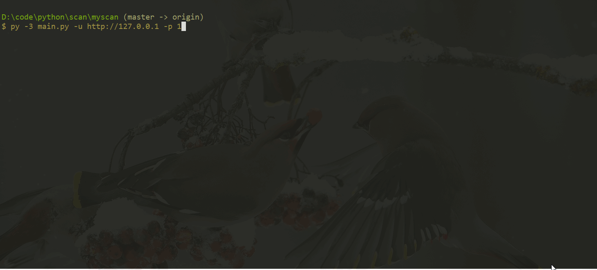

### 端口扫描
-----


使用

```
python main.py -u ip -P [port1,port2,port3...] or [port1-port2]
```

支持两种方式

* 扫描特定的一个或多个端口  22,80,3389等
* 扫描指定端口范围的端口 -P 1-65535

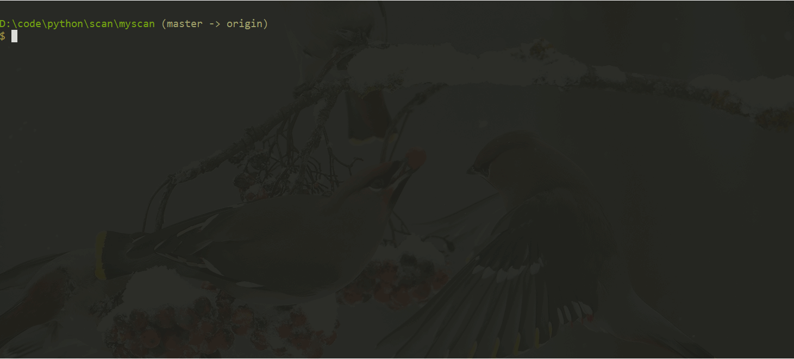

### 局域网ip扫描
-----


使用

```
python main.py -u 网络号/24 -sP 1
```

这里目前只支持A,B,C类的地址，不支持无类地址

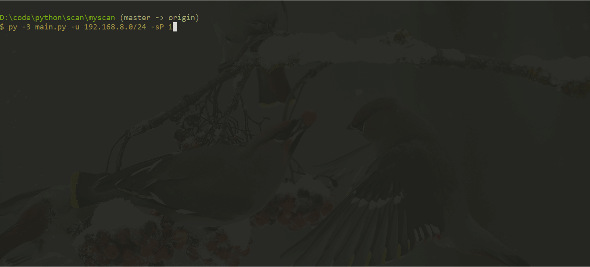

### web应用指纹扫描
------


使用

```
python main.py -u url --sqlit sqllit_file -f 1 
```

我这里把常见的一些应用的指纹储存在了一个.db文件中，这个文件在``database``文件夹下，可以自行进行添加，但是添加时请按照数据库里面的格式。

运行演示：

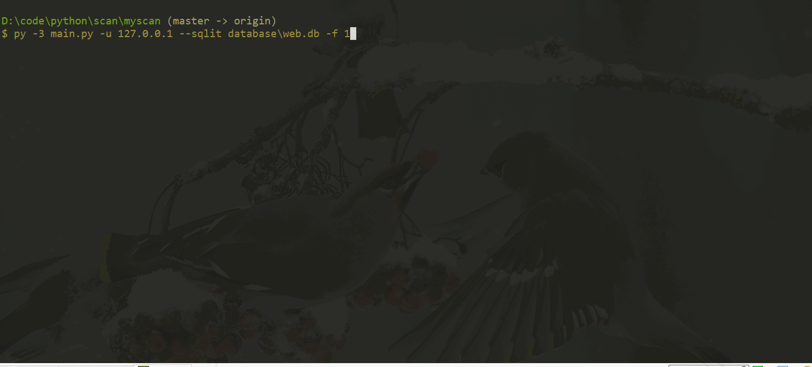


## 常见web漏洞扫描

-----

web漏洞的扫描可以单独扫描某个页面，也可以先用爬虫对目标站点进行url爬取，之后再对爬取后的url进行逐个扫描。爬虫部分使用了scrapy框架，爬取的url可以直接再quotes.py里面修改。接着直接运行即可。之后要配合扫描器的话，直接运行

```
python main_all.py
```

都是各个模块的默认设置，如果要添加自定义设置，需要在代码中自行添加参数。如果直接对单个页面进行进行漏洞检测的话，也可以直接使用漏洞检测部分。

### LFi && 目录穿越扫描
------

使用

```
python main.py -u http://xxxxx?fuzz=fuzz -F 1 --param_file file1 --value_file file2 -n 100 
```

这里可以选择对传递的参数和值都进行fuzz，此时就使用``?fuzz=fuzzz`` 如果参数名已经确定的话，此时就只需要fuzz参数值就可以 ``?file=fuzz`` 代码中会把fuzz 替换成穷举的值.
``-n``是使用得协程得数量，默认是100 也可以自己指定。

``param_file``是储存参数值的字典，有默认的文件，可以自己指定。``value_file``是值得字典，也有默认得文件，可以自己指定。 在``directory``文件夹下有常见得爆破字典文件。

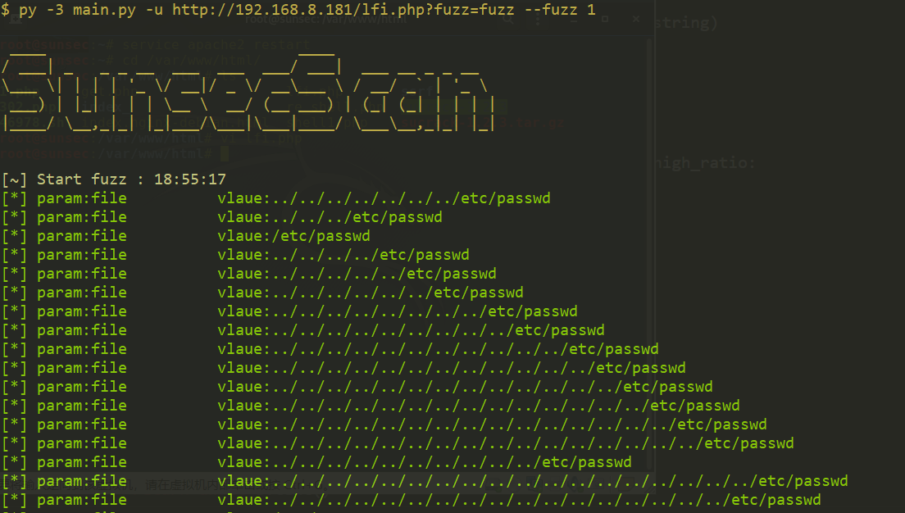

### xss
------

用法

```
python main.py -u http://127.0.0.1/php/2.php?a=* --xss 1 [--payload_num]
```
要传递参数得地方要使用``*``之后会把``*``进行替换。

``xss``文件下的``make_payload.py`` 这个文件用来生成xss常用的payload。里面对应了常见的xss绕过思路，包括编码，大小写，空格替换、括号替换等。可以自己根据实际情况进行修改。

运行

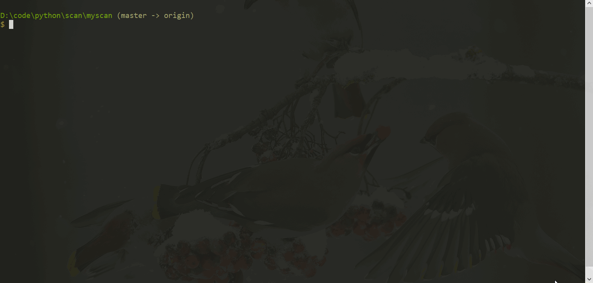

### sql注入
----------

sql注入模块``主要作用是发现注入点，同时fuzz过滤的规则，找到可以注入的payload格式``，并不包括数据注入部分。之后对数据进行注入的时候，需要``配合sqlmap``，通过自定义sqlmap的payload 进行数据的注入。

这里主要使用的注入方法有 union注入、基于错误的注入、基于boolen的注入，基于时间的注入。

#### union 注入

------

使用

```
python main.py -u url --sql 1 --union 1 [--method 默认get][--r request请求包]
```

union 注入默认是get类型的。其他类型可以自己指定。头文件主要是配合post类型，类似sqlmap中的-r参数。

* 注入payload处用``*``替代

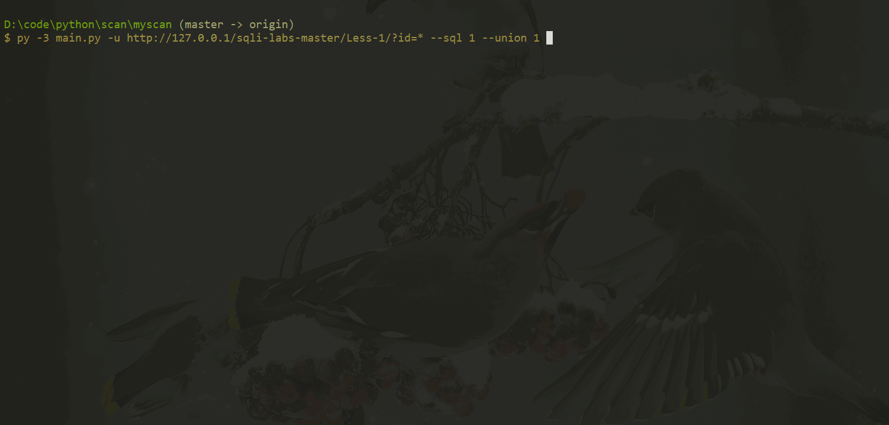

#### error注入

------

使用


```
python main.py -u url --sql 1 --error 1 [--method 默认get][-r request请求包] [--payload_num default 10]
```
默认是get类型的。其他类型可以自己指定。头文件主要是配合post类型，类似sqlmap中的-r参数。``payload_num``用来指定输出的可用的payload的个数，默认是10

* 注入payload处用``*``替代

在``sql_injection/make_dict``下面的``error_make_dict.py``用来生成error注入的字典，主要是sql注入中一些常见的绕过，eg：逗号，空格，大小写混合，重叠等。可以自定义添加，生成特定的字典。生成的字典会存在``sql_injection/payload``下面

这里使用了协程，数量默认是200 可以自行修改。

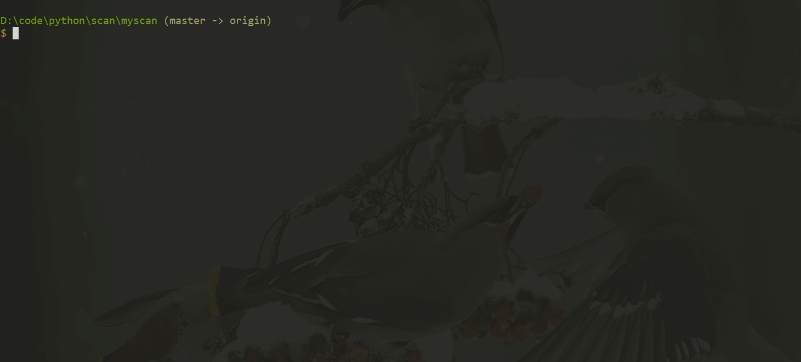

#### Boolen注入
------

使用

```
python main.py -u url --sql 1 --boolen 1 [--method 默认get][--r 配合post request请求包] [--payload_num default 10] [--thread_num 线程数 默认100] [--true_string] [--false_string]
```
* 注入payload处用``*``替代
* 默认是get类型的,其他类型可以自己指定。
* 头文件主要是配合post类型，类似sqlmap中的-r参数。
* ``payload_num``用来指定输出的可用的payload的个数，默认是10.
* thread_num 时线程数
* true_string 是输入的payload为true的时候，页面出现的字符串，可以提高准确度
* false_string 时输入的payload为False的时候，页面出现的字符串，可以提高准确度

在``sql_injection/make_dict``下面的``Boolen_make_dict.py``用来生成Boolen注入的字典，主要是sql注入中一些常见的绕过，eg：逗号，空格，大小写混合，重叠等。可以行添加规则，生成特定的字典。生成的字典会存在``sql_injection/payload``下面

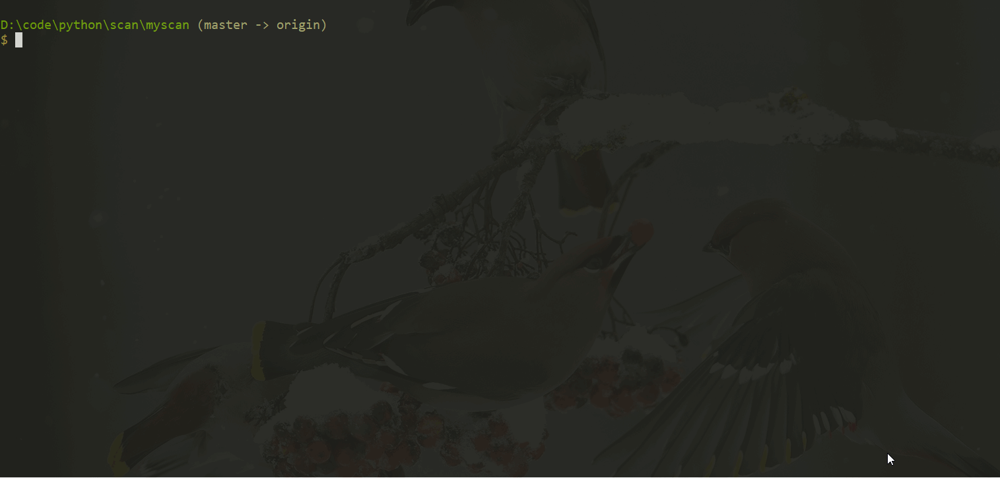

#### Time注入
------

使用

```
python main.py -u url --sql 1 --time 1 [--method 默认get][--headfile 配合post] [--payload_num default 10] [--thread_num 线程数 默认100] [--wait_time sleep的时间]
```

默认是get类型的。其他类型可以自己指定。头文件主要是配合post类型，类似sqlmap中的-r参数。``payload_num``用来指定输出的可用的payload的个mm  m数，默认是10
2m
  在``sql_injection/make_dict``下面的``time_make_dict.py``用来生成time注入的字典，主要是sql注入中一些常见的绕过，eg：逗号，空格，大小写混合，重叠等。可以自定义添加，生成特定的字典。生成的字典会存在``sql_injection/payload``下面。
 
*  注入payload处用``*``替代

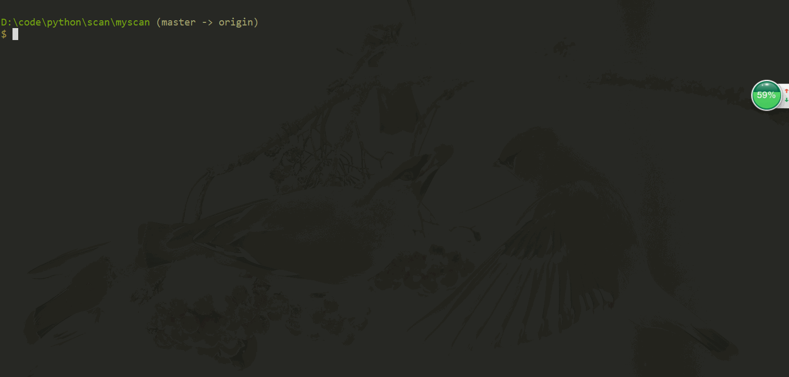
0
### ssrf

```
python  main.py -u url [--redirect_file 远程服务器302跳转文件]  --ssrf 1
```
* -u 是注入的url，参数处要用``*``替换
* --redirect_file 是重定向文件的路径，如果不检测重定向，可以不指定这个参数

目录下的url.txt是http检测时绕过对127.0.0.1的检测，可以自行添加或删除

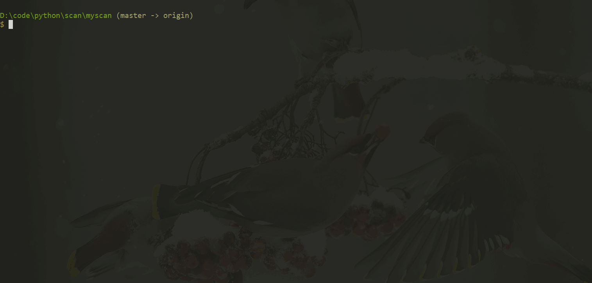